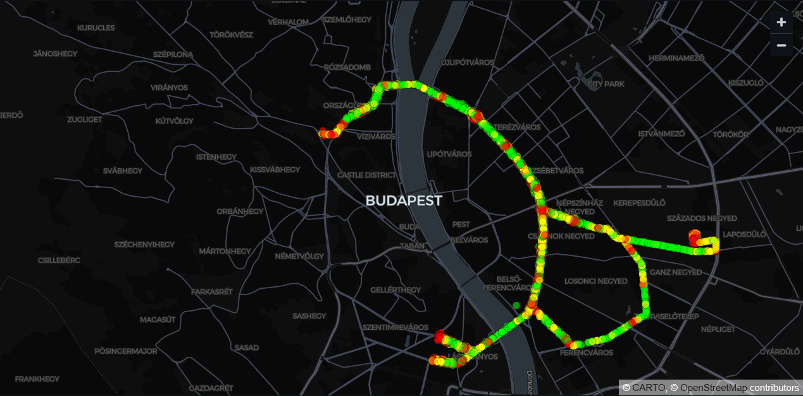
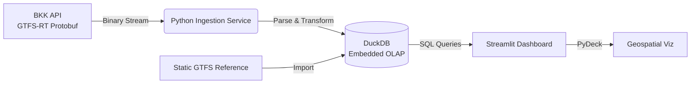
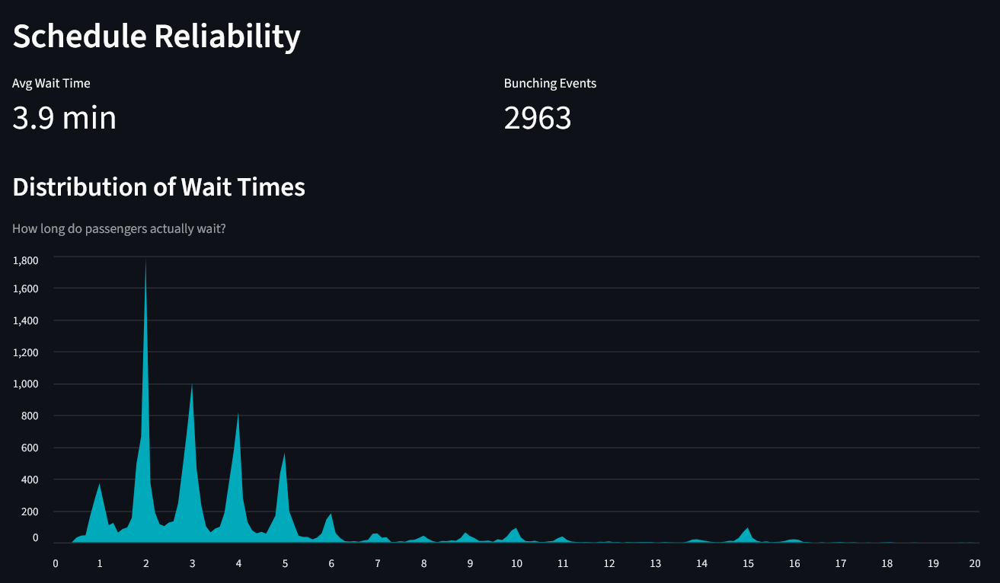
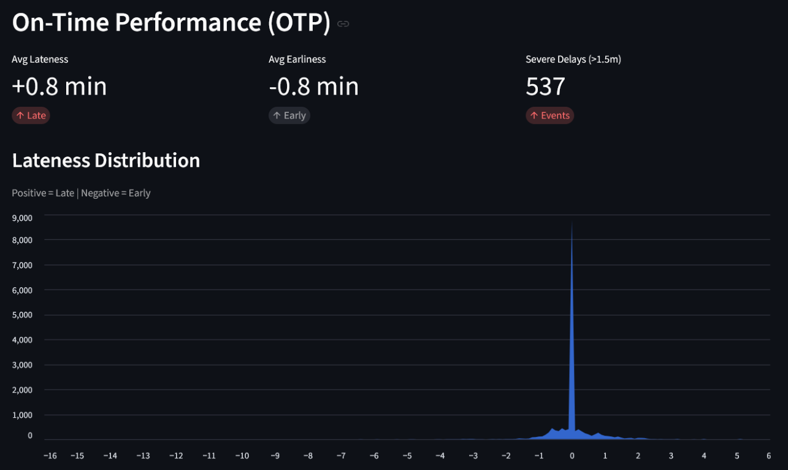

# 🚋 Budapest Real-Time Tram Analytics Pipeline

   

**A high-performance data pipeline that consumes real-time GTFS-RT binary feeds to visualize traffic patterns, schedule adherence, and "bunching" events for the Budapest tram network.**



## 📖 Overview

This project answers a simple question: **"How does the Budapest tram network _actually_ perform right now?"**

It bypasses static schedules to ingest **live binary data (Protobuf)** from the BKK Futár API. By processing vehicle positions and trip updates in real-time, the system calculates actual speeds, delays, and headways on the fly, storing them in an embedded OLAP database (DuckDB) for high-performance geospatial querying.

### Key Features

- **Real-Time Ingestion:** Consumes GTFS-Realtime (Protocol Buffers) feeds every 10-15 seconds.
- **Geospatial Analytics:** Uses **DuckDB Spatial** to calculate live vehicle speed and distance between updates using `ST_Distance_Spheroid`.
- **Metric Calculation:** Computes "Tram Bunching" (when trams arrive too close together) using SQL window functions (`LAG`, `LEAD`) over time-series data.
- **Containerized:** Fully Dockerized environment with `docker-compose` for one-command deployment.

---

## 🏗️ Architecture



### The Tech Stack

- **Ingestion:** Python `requests`, `google.transit` (Protobuf bindings).
- **Storage:** **DuckDB** (Chosen for its columnar speed and handling of analytical SQL queries on local files).
- **Visualization:** **Streamlit** + **PyDeck** (3D mapping).
- **Orchestration:** Docker & Shell scripts.

---

## 🚀 Getting Started

### Prerequisites

- Docker & Docker Compose
- A BKK API Key (Request one [here](https://opendata.bkk.hu/))

### Installation

1.  **Clone the repo:**

    ```bash
    git clone [https://github.com/yourusername/bkk-analytics.git](https://github.com/yourusername/bkk-analytics.git)
    cd bkk-analytics
    ```

2.  **Configure Environment:**
    Create a `.env` file in the root directory:

    ```bash
    BKK_API=your_api_key_here
    ```

3.  **Run the Pipeline:**
    Use Docker Compose to spin up the ingestion script and the dashboard simultaneously:

    ```bash
    docker-compose up --build
    ```

4.  **View the Dashboard:**
    Open `http://localhost:8501` in your browser.

---

## 📂 Project Structure

```text
├── queries/             # SQL logic for analytics views (separated for readability)
├── scripts/             # Utility scripts (e.g., static GTFS importer)
├── src/                 # Core Python modules (API client, DB handlers)
├── config.yaml          # Configuration (target routes, fetch intervals)
├── dashboard.py         # Streamlit visualization layer
├── docker-compose.yaml  # Container orchestration
├── Dockerfile           # Environment definition
├── main.py              # Pipeline entry point
├── requirements.txt     # Python dependencies
└── run_pipeline.sh      # Helper script for local execution
```

---

## 📊 Analytics & Insights

The dashboard provides three layers of analysis.

### 1. Network Reliability & Punctuality

The system detects service anomalies by comparing real-time position data against static schedules and historical headways.

<div align="center">
  
  
</div>

- **Left (Tram Bunching):** The distribution of wait times. The sharp spikes at 2, 3, and 4 minutes indicate regular service, while the "long tail" identifies bunching events.
- **Right (On-Time Performance):** A histogram of schedule adherence. The spike at `0` shows high adherence, with the spread indicating early vs. late arrivals.

### 2. Real-Time Traffic Flow

(See header image)

- **Speed Analysis:** Visualizes traffic flow in 3D.
- **Congestion Detection:** Identifies "stuck" trams (<10km/h) vs free-flowing segments in real-time.

---

## 🛠️ Challenges & Learnings

- **Binary Data:** Parsing `GTFS-Realtime` required handling Protocol Buffers directly, rather than simple JSON APIs.
- **Geospatial Noise:** GPS drift caused stationary trams to appear as moving. Implemented a filter in SQL (`ST_Distance > 5m`) to eliminate noise.
- **Timezone Complexity:** Handling the offset between UTC timestamps in the API and Budapest Local Time (CET/CEST) for accurate scheduling.

---

## 🔮 Future Improvements

- **Historical Data Warehouse:** Move from local DuckDB to a cloud warehouse (Snowflake/BigQuery) for long-term trend analysis.
- **Alerting System:** Add a Discord/Slack bot to notify when severe delays (>15 mins) occur on key routes.

---

### Author

**Ilkin Gambarli**
[LinkedIn](https://www.linkedin.com/in/ilkin-gambarli-605329227/)
